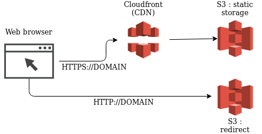

# Terraform for create a static website (S3 / Cloudfront)

Simple module to deploy a S3 and Cloudfront stack on AWS.

This module was originally design for this article (in French) : [link](https://www.damyr.fr/posts/premier-module-terraform/)

Feel free to contribute !

<!-- BEGINNING OF PRE-COMMIT-TERRAFORM DOCS HOOK -->
## Requirements

No requirements.

## Providers

No provider.

## Inputs

| Name | Description | Type | Default | Required |
|------|-------------|------|---------|:--------:|
| certificate | ARN of certificate (ACM) | `string` | n/a | yes |
| domain | The domain of static website | `string` | n/a | yes |
| error | The name of website error files | `string` | `"error.html"` | no |
| https\_redirect | Select if the site is redirect to https | `bool` | `true` | no |
| index | The name of website index files | `string` | `"index.html"` | no |

## Outputs

| Name | Description |
|------|-------------|
| bucket\_domain\_name | The full domain for S3 |
| bucket\_id | The id of website S3 bucket |
| cdn\_arn | The cloudfront distribution arn |
| cdn\_domain | AWS domain for cloudfront |
| cdn\_id | The cloudfront distribution id |

<!-- END OF PRE-COMMIT-TERRAFORM DOCS HOOK -->
